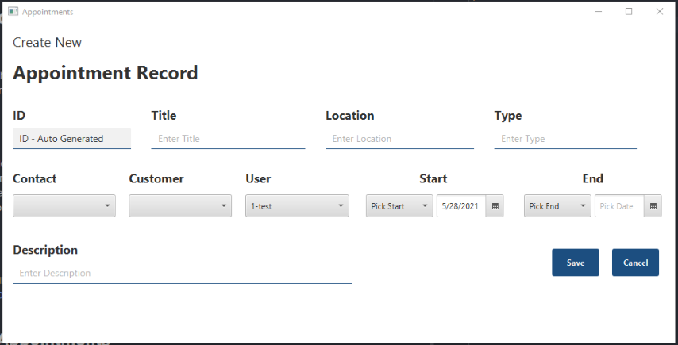

# JavaFX Appointments

A tool that allows users to do manage customer and appointment records.

GUI App built using JavaFX that can be used to create, update, and delete customer  
and appointment records using a remote MySQL database connection.  

## Features
* Activity logging for user login attempts to log_activity file.
* Alerts for current user for appointments within 15 minutes of login.
* Create/Update/Delete new customers & appointments in remote database.
* Generate basic text reports for contact schedules and appointment types.

## Dependencies
<!--- These are just example requirements. Add, duplicate or remove as required --->
* [Java SE 11](https://openjdk.java.net/ "OpenJDK") or higher AND [JavaFX 11](https://gluonhq.com/products/javafx/ "JavaFX") OR [Zulu 11 JDK FX](https://www.azul.com/downloads/?version=java-11-lts&package=jdk-fx "Zulu JDK FX")
* [MySQL Connector for JDBC 8.0.23](https://dev.mysql.com/downloads/connector/j/ "MySQL Community Downloads") or later

## Install JavaFX Appointments

To use JavaFX Appointments, follow these steps:

1. Clone this `git clone git@github.com:sfwatanabe/javafx_appointments.git`
2. Open project in your IDE
3. Run database setup script for MySQL `/utils/JFXAppointments.sql`. Recommend changing `YOUR_DATABASE` on line 1 & 2
4. Add the following folder and file to the project `/resources/config/config.properties`
5. Add the following to the `config.properties` 
> ```
> # Your Database Connection Information
> dbUrl=//URL_TO_YOUR_SERVER/YOUR_DATABASE
> userName=USER_NAME
> password=USER_PASSWORD
> ```                                                                 
6. Make sure MySQL and JavaFX libraries have been added to your project settings.
7. You should be ready to build & run.
8. Default user & password are  `test`. You can configure via MySQL in users table. 

NOTE  - config.properties should already be on the .gitignore list

## Screenshots




